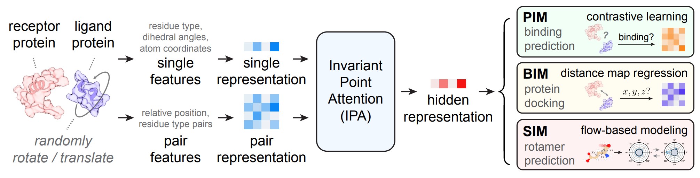

# ProMIM - Multi-level Interaction Modeling for Protein Mutational Effect Prediction

<br>

Official repository for ["Multi-level Interaction Modeling for Protein Mutational Effect Prediction"](https://arxiv.org/pdf/2405.17802).

<!--  -->


**Figure:** *The overview framework of ProMIM.*

> **Multi-level Interaction Modeling for Protein Mutational Effect Prediction** <br>
> Yuanle Mo*, Xin Hong*, Bowen Gao, Yinjun Jia, Yanyan Lan <br>

[](https://github.com/hughplay/TVR)
[](https://arxiv.org/pdf/2405.17802)
[](https://pytorch.org/get-started/locally/)


<br>

## Description

Protein-protein interactions are central mediators in many biological processes. Accurately predicting the effects of mutations on interactions is crucial for guiding the modulation of these interactions, thereby playing a significant role in therapeutic development and drug discovery. Mutations generally affect interactions hierarchically across three levels: mutated residues exhibit different *sidechain* conformations, which lead to changes in the *backbone* conformation, eventually affecting the binding affinity between *proteins*. However, existing methods typically focus only on sidechain-level interaction modeling, resulting in suboptimal predictions. In this work, we propose a self-supervised multi-level pre-training framework, ProMIM, to fully capture all three levels of interactions with welldesigned pre-training objectives. Experiments show ProMIM outperforms all the baselines on the standard benchmark, especially on mutations where significant changes in backbone conformations may occur. In addition, leading results from zero-shot evaluations for SARS-CoV-2 mutational effect prediction and antibody optimization underscore the potential of ProMIM as a powerful next-generation tool for developing novel therapeutic approaches and new drugs.

If you find this code useful, please consider to star this repo and cite us:

```
@article{mo2024multi,
  title={Multi-level Interaction Modeling for Protein Mutational Effect Prediction},
  author={Mo, Yuanle and Hong, Xin and Gao, Bowen and Jia, Yinjun and Lan, Yanyan},
  journal={arXiv preprint arXiv:2405.17802},
  year={2024}
}
```


<br>


## Environment Setups
**1. Clone the Repository**
```bash
git clone https://github.com/mylRalph/ProMIM.git
cd ProMIM
git clone https://github.com/anton-bushuiev/PPIRef.git
```
**2. Prepare the Environment**

For the `promim` environment, we suggest installing the `unicore` package from [Uni-Core](https://github.com/dptech-corp/Uni-Core/releases). The `ppiref` environment is used for parsing the PPIRef50K dataset. Please refer to the official [PPIRef](https://github.com/anton-bushuiev/PPIRef/tree/main) repo for detailed instructions. 
```bash
conda create -n promim python=3.8
conda activate promim
pip install -r requirements.txt
conda create -n ppiref python=3.10
```

## Datasets
**1. Get PPIRef50K**

Download PPIRef50K dataset, and split it into training and validation sets by running:
```bash
conda activate ppiref
python ./data/get_ppiref50k.py
```
Use the following command to preprocess PPIRef50K:
```bash
conda activate promim
python ./src/datasets/ppiref50k.py
```

**2. Get SKEMPI2**
```bash
cd data
bash ./get_skempi_v2.sh
cd ..
```

## Inference

Download the trained weights from [Google Driver](https://drive.google.com/drive/folders/1fDn-qps7Lgejd8dowegujJSQE2QJQOeD) and put them into the `trained_models` folder. We use the trained weight of RDE from the [RDE-PPI](https://github.com/luost26/RDE-PPI) repo for SIM. 

**1. Predicting Mutational Effects on Protein-Protein Binding**

```bash
bash ./scripts/test/test_promim_skempi.sh
```

Remember to specify the `idx_cvfolds` parameter to evaluate on the particular fold. You can chose from `0,1,2`.
```bash
ckpt=./trained_models/promim_skempi_cvfold_2.pt
device=cuda:0
idx_cvfolds=2

python test_promim_skempi.py \
    --ckpt $ckpt \
    --device $device \
    --idx_cvfolds $idx_cvfolds
```

**2. Predicting Mutational Effects on Binding Affinity of SARS-CoV-2 RBD**

```bash
bash ./scripts/test/test_promim_6m0j.sh
```

**3. Optimization of Human Antibodies against SARS-CoV-2**

```bash
bash ./scripts/test/test_promim_7fae.sh
```

## Training
**1. Train ProMIM**

```bash
bash ./scripts/train/train_promim.sh
```
You can set the `wandb` flag and `wandb_entity` parameter in `train_promim.sh` to use [Weights & Biases](https://wandb.ai/site) for logging or use TensorBoard by default.

```bash
nproc_per_node=4
world_size=4
master_port=20888
config_path=./configs/train/promim.yml

CUDA_VISIBLE_DEVICES=0,1,2,3 python -m torch.distributed.launch --nproc_per_node=$nproc_per_node --master_port=$master_port train_promim.py \
    --config $config_path \
    --world_size $world_size \
    --wandb \
    --wandb_entity your_wandb_username
```

**2. Train ProMIM DDG Predictor**
```bash
bash ./scripts/train/train_promim_skempi.sh
```

## Cite us
If you find our work useful, please cite our paper:
```
@article{mo2024multi,
  title={Multi-level Interaction Modeling for Protein Mutational Effect Prediction},
  author={Mo, Yuanle and Hong, Xin and Gao, Bowen and Jia, Yinjun and Lan, Yanyan},
  journal={arXiv preprint arXiv:2405.17802},
  year={2024}
}
```

## License
The code is released under the [MIT license](LICENSE).
